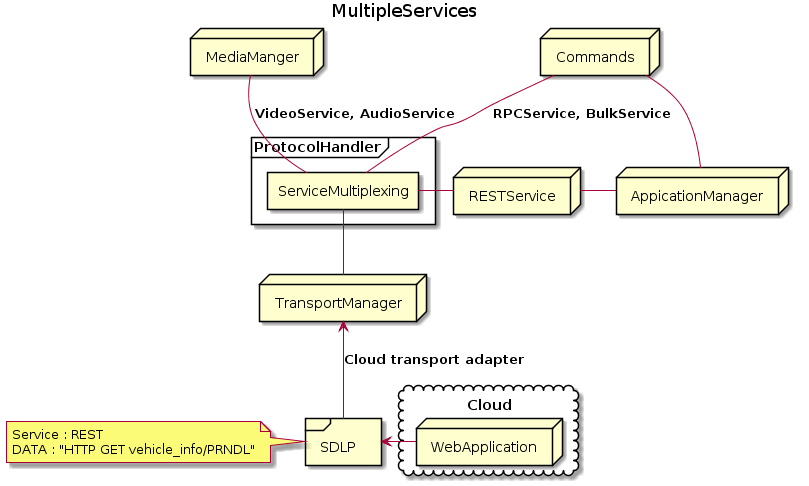
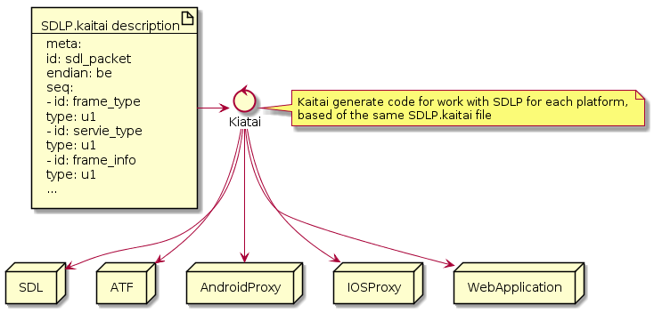

# Low level non RPC application services 

* Proposal: [NNNN](nnnn-http-app-service.md)
* Author: [Alexander Kutsan](https://github.com/LuxoftAKutsan)
* Status: **Awaiting Review**
* Impacted Platforms: [Core]

## Introduction

Provide ability for application to register own non RPC services that may handle arbitrary data. 

Communication between SDL and mobile consists of different levels:
 
 1. Transport level
 2. Protocol level
 3. RPC/Streaming/Bulk level

SmartDeviceLink Protocol may also transfer arbitrary data. 
So application will not be required to implement and to use RPC for communication with SDL for some use cases. 

## Motivation

### Motivation for OEM producers
SDL RPC Service (using MOBILE_API) is rather complicated and huge for support.
Also it adds a lot of additional requirements for both OEM provider and application developer. 

OEM provider may need some custom communication with mobile application and RPC usage is too complicated and overloaded.
Any modification of RPC service requires experience in SDL core. 
Any modification of RPC service adds big possibility of regression to existing open source SDL functionality.

Adding additional custom service support with plugin extensible system will provide ability for seamless integration of proprietary features using SmartDeviceLink for OEM producers 

OEM provider can use raw data exchange for custom services, but SDLP (SmartDeviceink Protocol) is better.
Benefits of SDLP usage described below. 

SDLP guarantees:
 - Messages uniqueness 
 - Delivery guaratee.
 - Keep connection/session alive (heart beat)
 - Session multiplexing
 - Malformed messages filtering
 - Messages encryption

### Motivation for application developers 

SDL should provide ability to use only [SmartDeviceink Protocol](https://github.com/smartdevicelink/protocol_spec) as protocol for data transfer. 

SDL should provide RESTfull API for in-car resources that will be used by web applications that will connect to SDL via cloud transport adapter. 

**Cloud transport adapter** proposal opens huge horizon of possibilities to use SDL by Web Applications.

Web application can be created on any platform (PHP, python, JavaScript), and there is no ability to use Proxy library in their code.

RPC is not usual technology in web world, and requirement MOBILE API over RPC implementation will be big obstacle for WebApplication to support SDL.

## Proposed solution

Implement pluggable structure of protocol handler that Will load supported services as plugins.

List of proposed services :
 - RPCService
 - MediaService
 - REST service

### REST service

REST service will be useful for Web applications that usually use REST paradigm against RPC for communications.

MOBILE_API will be partially converted to REST API:

### SDL resources in REST API:

#### Vehicle data
For vehicle information following resources available.

 - `/vehicle_data/speed`
 - `/vehicle_data/rpm`
 - `/vehicle_data/fuellevel`
 - `/vehicle_data/fuel_state`
 - `/vehicle_data/fuel_consumption`
 - `/vehicle_data/extern_temp`
 - `/vehicle_data/turn_signal`
 - `/vehicle_data/prndl`
 - `/vehicle_data/tire_pressure`
 - `/vehicle_data/odometer`
 - `/vehicle_data/belt_status`
 - `/vehicle_data/body_info`
 - `/vehicle_data/device_status`
 - `/vehicle_data/ecall_info`
 - `/vehicle_data/device_status`
 ...

`GET` request for each the resource is equivalent to `GetVehicleData` RPC request.

#### Commands 
 Commands should provide information about registered commands for the application

 - `/commands`

 `POST` request for `/commands` the resource is equivalent to `AddCommand` RPC request.

### TBD : List all SDL resources in RESTfull style

### Protocol implementation

SmartDevicelink Protocol can be implemented with [Kaitai Struct](https://kaitai.io/) technology.
It will provide ability for app developers to work with SDLP using any programming language.

[Kaitai Struct] will generate code for constructing and parsing SDL packets for :
 - smartDeviceLinkCore
 - AndroidProxy
 - IOs proxy
 - Automated Test framework
 - Web application that works with SDL

### Custom Services

Application may register on SDL custom service for data processing. 

SDL will share this services with other registered applications. 
And transmit data across applications.

## Potential downsides

Increasing the number of plugins.

## Impact on existing code

#### Core

Protocol handler should be changed to pluggable structure. REST Service should be implemented as a plugin. 

## Alternatives considered

Use currend SDL RPC Service approach.
