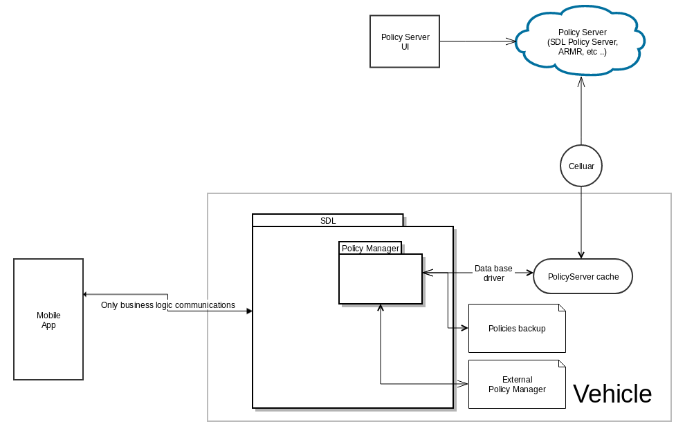
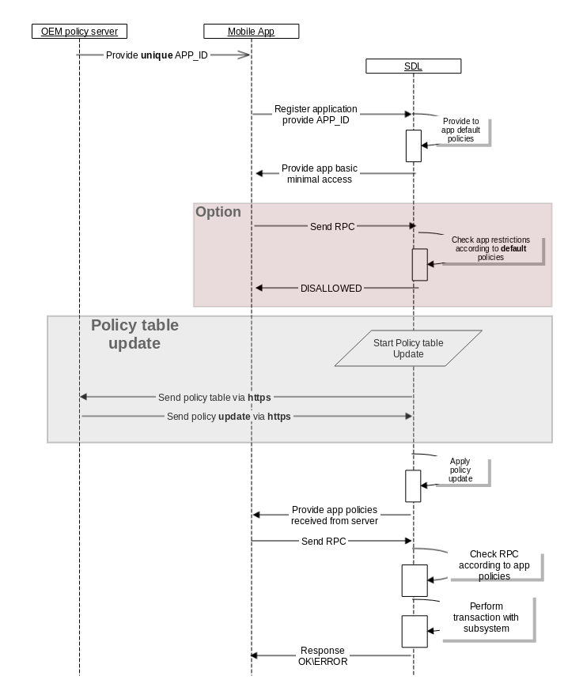

# Policy Server direct communication

* Proposal: [SDL-NNNN](nnnn-policy_server_direct_communication.md)
* Author: [Alexander Kutsan](https://github.com/LuxoftAKutsan)
* Status: **Awaiting review**
* Impacted Platforms: [Core]

## Introduction

This proposal is about communication with Policy Server directly via vehicle cellular data. It is aimed to reduce communications between mobile app, SDL and Policy server and to simplify Policy Table Update flow.

## Motivation

Policy Table Update is a complicated process that requires sending a lot of RPC messages and a lot of data through mobile channel.  
Next generation of headunits will have direct cellular access to internet and communication with Policy Server could be done directly without using SDLProxy and Mobile cellular data.  
It is proposed to remove layer of abstraction in Policy Table Updates. It will reduce amount of data sent via mobile transport, simplify Policy Table Update.  
Also, there would be no need to add extra encryption for Policy table, because there will be no intermediate actors between SDL and PolicyServer. The HTTPS connection would be sufficient.

List of improvements :
 - Reduce amount of service communications with mobile
 - Increase performance and robustness of Policy Table Update
 - Avoid additional encryptions and reduce amount of actors playing in Policy Table Update flow
 

## Proposed solution

To create direct connection to Policy Server from SDL. So PolicyManager will perform HTTPS request for fetching Policy Table Updates directly.

### Existing approach of Policy Table Update

### Proposed approach of Policy Table Update

## Potential downsides

It requires cellular connection in vehicle.
If vehicle connection goes down there is no possibility to perform Policy Table Update.

## Impact on existing code

Impacts the following SDL core layers:
  - Policy Manager
  - Application Manager
  
Existing RPCs like `BasicCommunication.PolicyUpdate`, `SDL.GetURLs`, and some requests types in `SystemRequest` will be redundant. 

## Alternatives considered

Continue using mobile proxy for Policy Table Update.
