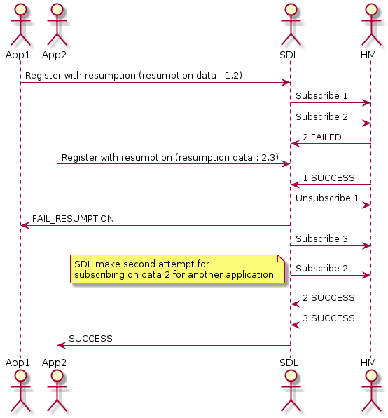

# Handle response from HMI during resumption data

* Proposal: [SDL-NNNN](nnnn-resumption-data-error-handling.md)
* Author: [Alexander Kutsan](https://github.com/LuxoftAKutsan)
* Status: **Awaiting review**
* Impacted Platforms: [Core]

## Introduction
The aim of this feature is to handle HMI error responses while restoring the data during resumption process.

## Motivation

During resumption some data may not be restored due to HMI error response to add persistent data request.

SDL should take care of these possible issues and fail resume data that might not be restored. 

## Proposed solution

During registration with correct hash_ID SDL should send all required requests/notification for restoring persistent data.

List of persistent data to restore : 

 - AddCommand (Menu + VR)
 - AddSubMenu
 - CreateInteractionChoiceSet
 - SetGlobalProperties
 - SubscribeButton
 - SubscribeVehicleData
 - SubscribeWayPoints

After successful responses are received for all HMI requests, SDL should send successful response to mobile application `RegisterAppInterfaceResponse(success=true,result_code=SUCCESS)` 
and OnHashChangeNotification.

If HMI responds with any kind of error or does not respond to any requests sent during resumption, SDL should revert already restored data with appropriate RPCs:
 - DeleteCommand
 - DeleteSubMenu
 - DeleteInteractionChoiceSet
 - ResetGlobalProperties
 - UnsubscribeButton
 - UnsubscribeVehicleData
 - UnsubscribeWayPoints

In the case some data, like a subscription, is already used by other applications, this means that the subscription is actual and SDL should not send unsubscribe requests to HMI. 

After reverting persistent data SDL should respond `RegisterAppInterfaceResponse(success=true,result_code=RESUME_FAILED)` to mobile application.

If multiple applications are trying to restore the same subscription, SDL should send the only first subscription to HMI. 
If the first subscription was failed and application received `result_code=RESUME_FAILED` result code, for the second application SDL should also try to restore the subscription.

Following picture shows that SDL should make an attempt for subscribing second application even if first app received error for this subscription during resumption:

Following picture is an example of error handling for subscriptions during parallel resumption of 2 applications: 

## Potential downsides
This approach may slow down app registration, in cases when there is a lot of resumption data. 

## Impact on existing code

Impacts resumption component of SDL and application registration process.

## Alternatives considered

#### Do not check response from HMI
If application was able to send any persistent data during previous connection, there should be no reason to not restore this data.  
So this proposal is more about unexpected or incorrect HMI behavior. 

#### Create special result code "partial resumption"

Prevent resumption failing in the case when part of the data is rejected by the HMI, then send in the RegisterAppInterfaceResponse information field what data was not able to be restored.

Options :
 1. Provide information about data that was not restored in info field.
 2. Extend RegisterAppInterfaceResponse API with special field that will contain data that was not restored.

This solution is over engineering because, if application was able to send any persistent data during previous connection, there should be no reasons do not restore this data.
