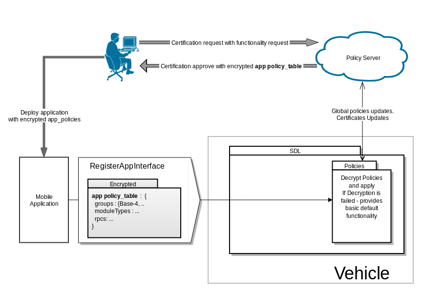
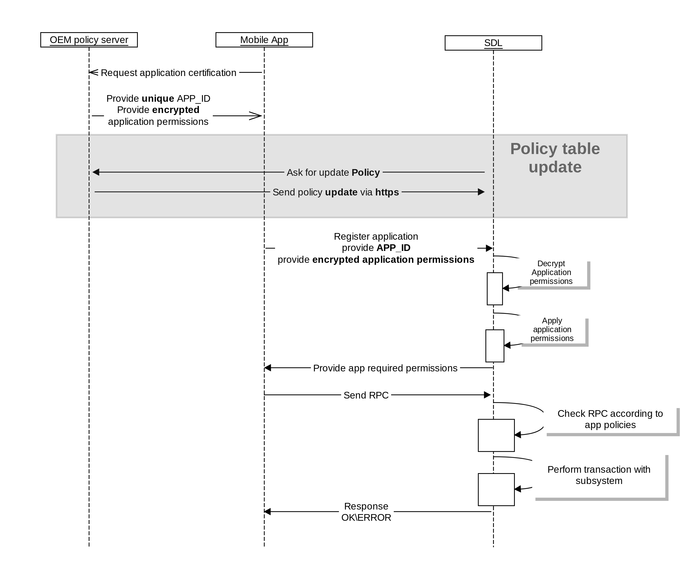

# Send app permissions within registration

* Proposal: [SDL-NNNN](nnnn-send_permissions_within_app_register.md)
* Author: [Alexander Kutsan](https://github.com/LuxoftAKutsan)
* Status: **Accepted with Revisions**
* Impacted Platforms: [Core]

## Introduction

Application may send required policies within its registration. 
So SDL will not have to perform Policy table Update after each app registration.


## Motivation

This will avoid mandatory policy update right after new application registration. 
Will reduce amount of data that SDL will exchange with Policy Server.

Resolved Problems with the approach :

    SDL requires Policy Update after each registration
    Big amount of data should be transferred for policy update 
    Cellular connection may be not stable and not permanent.

## Proposed solution

Proposed to Add changes to `RegisterAppInterfaceRequest` 

```
 <function name="RegisterAppInterface" functionID="RegisterAppInterfaceID" messagetype="request" since="1.0">
     <param name="app_policies" type="String" mandatory="true" since="N.N">
            <description>Encrypted Application Permissions</description>
     </param>
```




The flow within implementation of proposal : https://github.com/LuxoftAKutsan/sdl_evolution/blob/policy_direct_connection/proposals/nnnn-policy_server_direct_cellular_connection.md 



 
## Potential downsides

 - Increase amount of data in RegisterAppInterface

## Impact on existing code

 Will affect sdl_core and policies


## Alternatives considered
 
