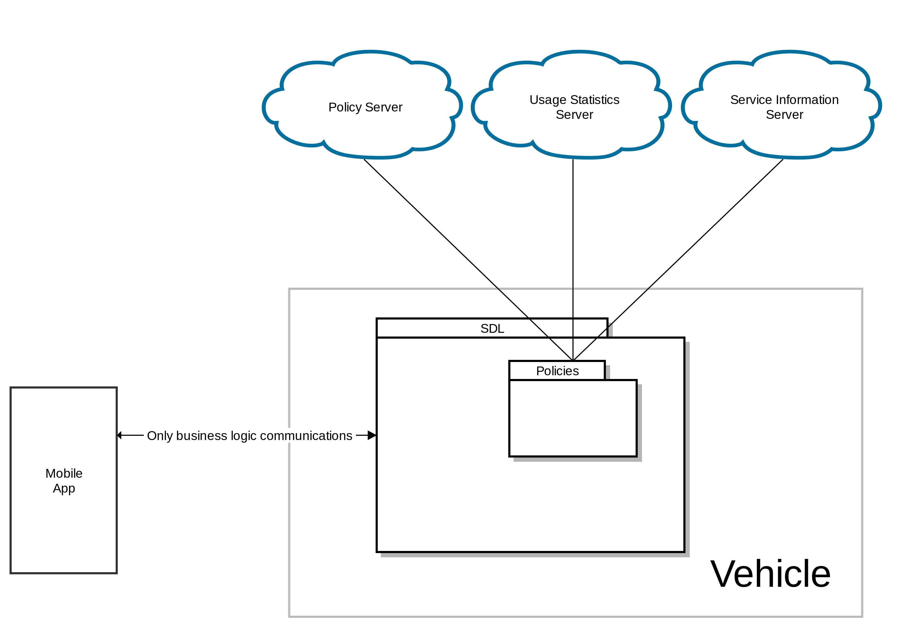
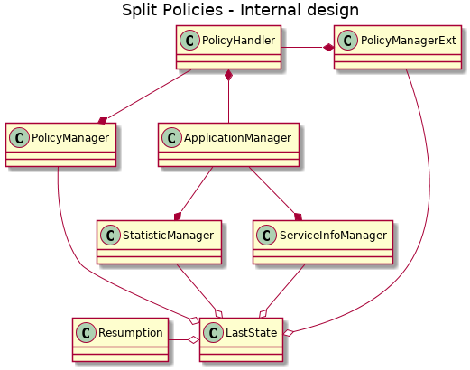

# Split Policies into logically separated data bases 

* Proposal: [SDL-NNNN](nnnn-split_policies.md)
* Author: [Alexander Kutsan](https://github.com/LuxoftAKutsan)
* Status: **Awaiting review**
* Impacted Platforms: [Core, PolicyServer]

## Introduction
This proposal is to extract data not related to policies from Policy Table.

Data :
 - Consumer friendly messages
 - Usage statistics

This information has no impact on application and device restrictions. Therefore, separate logical data bases could be used.

## Motivation

SDL stores in policies everything that it should retrive from OEM server. 

This triggers folowing problems : 
 - Big amount of communications for Policy Update
 - Policy table is big and complicated
 - Policy component of SDL is complicated. 
 - Change in Policies may raize big regression. 
 - Hight frequency of policy Updates

SDL policies should be splitted to separate data bases and SDL should work with the separately. 
It will reduce frequency of data for updates, will simplify Policy Table, Policy component. 
Adding new data will not affect whole policy table. 

## Proposed solution

Split data sources to multiple data bases. Each data base should have its own triggers for update. 

### Policy server

Policy server should provide:
 - Application policies
 - Policy groups
 - Consented devices

Triggers for update:
 - An app registered is not listed in PT (device consented)
       - Policy Table Update in case of failed retry strategy during previous IGN_ON
 - On getting 'device consent' from the user (applicable to EXTERNAL_PROPRIETARY)
 - If PTU was requested by app from un-consented device
 - User initiates PTU request from HMI
 - OnPolicyUpdate from HMI

#### Data structures 

On trigger SDL will send by POST request snapshot with existing policies.  
Policy snapshot should match the following structure:

```
TODO: describe policy snapshot structure
```

For the response SDL will expect the following structure of Policy Update:

```
TODO: describe policy update structure
```

### Usage statistics

This database is about providing statistics about vehicle usage. SDL should not get any new information from this DB.

Triggers for update:
 - After "N" ignition cycles
 - After "N" kilometers
 - After "N" days

#### Data structures 

On trigger SDL will send snapshot with existing statistics.
Statistics snapshot should match folowing structure:

```
TODO: describe policy snapshot structure
```
SDL does not expect any response from the server.


### Service information

This data source contains:
  - User friendly message
  - Certificates
  - Solicy server URLs
  
Triggers for update :
 - Current date is "24 hours prior to module's certificate expiration date"
 - No "certificate" at "module_config" section
 - In case the invalid certificate exists in policies database
  

#### Data structures 

On trigger SDL will send by POST request snapshot with existing service information.  
Service information snapshot should match folowing structure:

```
TODO: describe policy snapshot structure
```

For the response SDL will expect following structure of service information update:

```
TODO: describe policy update structure
```




### Internal architecture 

SDL will extract Service information and usage statistics from original policy data base and Policy Component.


#### Use LastState for policy storage

Communication between SDL and Policy Server established via jsons. There is no reason to use SQL for internal policy storage.  
SDL should use Last state component for storing all information related to:

 - Resumption
 - Policies
 - Usage Statistics
 - Service Information

`LastState` component is responsible for appropriate storing/loading data and managing multithreading access.  

Hight Level design: 




## Potential downsides
The changes in already existing Policy Servers may be required. Should be investigaed by OEMs. 

## Impact on existing code
Impacts Policies in SDL.
 
## Alternatives considered
The only alternative would be to leave the data in PT as is, but that is judged to be a poor option.
