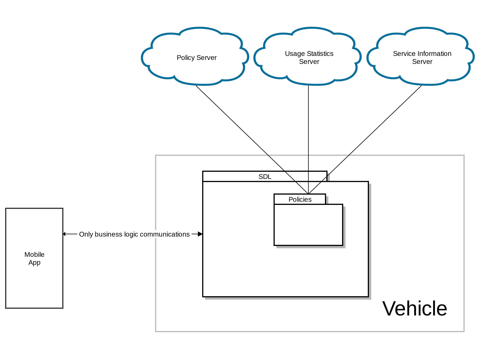

# Split Policies into logically separated data bases 

* Proposal: [SDL-NNNN](nnnn-split_policies.md)
* Author: [Alexander Kutsan](https://github.com/LuxoftAKutsan)
* Status: **Awaiting review**
* Impacted Platforms: [Core]

## Introduction
This proposal is to extract data not related to policies from Policy Table.

Data :
 - consumer friendly messages
 - usage statistics

This information has no impact on application and device restrictions. Therefore, separate logical data bases could be used.

## Motivation
The proposed solution resolves the following issues:

 - Big amount of communications for policy update
 - Policy table is big and complicated
 - Reduce frequency of policy Update

## Proposed solution

## Potential downsides
N/A

## Impact on existing code

## Alternatives considered
The only alternative would be to leave the data in PT as is, but that is judged to be a poor option.
